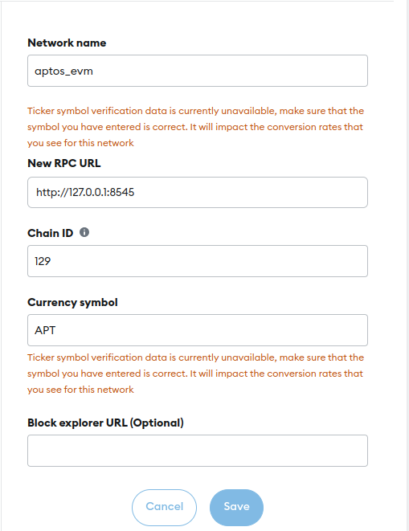
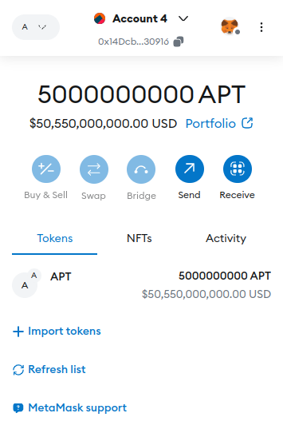
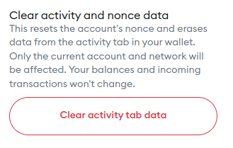

## Getting Started

Before you can launch the modified HEMVM client, you need to install a bit of addtional software.

* Install Rust [from an official website.](https://www.rust-lang.org/tools/install)
* Install Aptos CLI to issue commands to the client [from here](https://aptos.dev/en/build/cli)
* Install [Metamask](https://metamask.io/download/)
* We recommend using Google Chrome, but other browsers might work just fine.


(Optional) To avoid potential problems when building `rocksdb`:
* Install latest CLang and LLVM versions ([you might try this link or download it with your package manager](https://releases.llvm.org/))

(Optional) If you want to do smart contract development on this system (TBA if paper gets accepted):
* Install [Node.js](https://nodejs.org/en)
* Install [Python](https://www.python.org/downloads/) for Aptos Python SDK (or you can alterantively use JS/Rust)
* Install a developer toolkit for Ethereum, such as [Hardhat](https://hardhat.org/hardhat-runner/docs/getting-started)


## Running the client

Run the following command to build and run the client in the root folder of the repository:

```
cargo run --release -p aptos -- node run-local-testnet --with-faucet --faucet-port 8081 --force-restart --assume-yes --evm-genesis-account 0x14Dcb427A216216791fB63973c5b13878de30916
```

Command has been tested for Ubuntu and for Manjaro OS. The version of `rocksdb` library has been specifically bumped to avoid potential problems with compiling the client due to issues with LLVM and CLang versioning; actual experiments have been run on version `0.19.0` - if you want to measure the performance of the prototype, please change it to the version mentioned.

This command launches a client that accepts Aptos REST API requests on port 8080 and Ethereum JSON RPC accepting requests on port 8545. 
The command also launches a faucet for Aptos accounts on port 8081.

Account `0x14Dcb427A216216791fB63973c5b13878de30916` (private key `fafafafafafafafafafafafafafafafafafafafafafafafafafafafafafafafa`) will be funded with approx. 50 * 10^8 ETH upon the launch of the client. 

* [Guide](https://support.metamask.io/managing-my-wallet/accounts-and-addresses/how-to-import-an-account/#importing-using-a-private-key) on how to add an account using a private key to Metamask.

Once the client is running, run the follwing command once to set up your profile:

`aptos init` - to set up the CLI (run this only the first time after you have installed the Aptos CLI, choose options `local` and put `0x86b94222e0e35d40f8c54f398dce41f89203708ffc18fbc0e3cf0edbf75b00c3` private key once asked - you can put your own private key as well)

In order to fund an Aptos account, execute the following command in your terminal (the client should be running!):

`aptos account fund-with-faucet --account <your_private_key> --amount 9999999999999999`

* [Guide](https://support.metamask.io/networks-and-sidechains/managing-networks/how-to-add-a-custom-network-rpc/#adding-a-network-manually) on how to add a local network to the MetaMask. Please use the following parameters when setting up the network:



After you have set up the network, you should expect the following balance in your ETH account that you have imported:



If there are any issues with connectivity/balance, try restarting your browser. Metamask tries to connect to the network when the browser starts, and there could be issues if the client starts after you have opened the browser.

To transfer money in Aptos space:

* Run `aptos account fund-with-faucet --account 5f61e930582ca112420399eaac4d224aba550789bd31dbe3d8835abac4267b06 --amount <type any positive amount>` to activate and fund the receiver account
* Run `aptos account transfer --account 5f61e930582ca112420399eaac4d224aba550789bd31dbe3d8835abac4267b06 --amount <type your amount>` to actually transfer the tokens from your default account to the `5f61e930582ca112420399eaac4d224aba550789bd31dbe3d8835abac4267b06` account.


To transfer money in Ethereum space:
* Use this [guide](https://support.metamask.io/managing-my-tokens/moving-your-tokens/how-to-send-tokens-from-your-metamask-wallet/) from Metamask. There is no need to activate the recipient account.

After you restart the client, you would need to clear nonces in Metamask to re-run the example. You can find the menu from the picture below by clicking three dots in the top right corner of the extension UI, click Settings, Advanced, and you will find the button to clear nonces there.




This concludes the README and shows that existing tooling for both Aptos and Ethereum works with the provided client implementation for intra-space transactions. Cross-space demos will be shown later after the acceptance of the paper. 